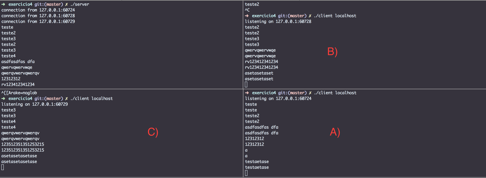
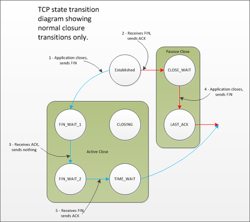

#Exercício 4
| NOME | RA |
|:-:|:------:|
| Renan Camargo de Castro | 147775 |

##Questão 1
Para fazer essa alteração, utilizei a função getsockname() após ter o socket conectado com connect(). Para poder imprimir, foi necessário ainda utilizar outras funções, como:

* **getsockname(s, (struct sockaddr \*) &info, &infoLen):** onde s é o descriptor do socket a pegar informações, info é o struct a ser colocado as informações dentro, e infolen é o tamanho.
* **inet\_ntoa(info.sin_addr):** Essa função serve para transformar um endereço de rede do formato struct in_addr para uma string com números e pontos.
* **ntohs(info.sin_port):** Função 'inversa' do htons(), isso é, converte um short do formato de rede(big-endian) para formato de host(little-endian, nos processadores intel).

Com isso, usamos o seguinte snippet para imprimir as informações:

~~~c
getsockname(s, (struct sockaddr *) &info, &infoLen);
fprintf(stdout, "listening on %s:%d\n", inet_ntoa(info.sin_addr),
					ntohs(info.sin_port));
~~~

##Questão 2
Aqui temos exatamente a mesma necessidade. Para imprimir o peer name, isso é, o cliente que está se conectando no servidor, é necessário usar as mesmas funções que na questão 1, apenas alterando o getsockname por getpeername.
O snippet fica o seguinte:

~~~c
getpeername(new_s, (struct sockaddr *) &info, &infoLen);
fprintf(stdout, "connection from %s:%d\n", inet_ntoa(info.sin_addr),
						ntohs(info.sin_port));
~~~
E deve ser colocado após a chamada de accept, pois alí já temos um cliente conectado.

##Questão 3

Para poder aceitar mais de um cliente, é necessário dividir o tratamento de cada cliente em subprocessos. Isso é feito com uma chamada a syscall fork(), em C.
Após receber um cliente com accept(), é criado um subprocesso para lidar com esse cliente, entrando em um loop.

~~~c
		if(fork() == 0){
		...
			while (len = recv(new_s, buf, sizeof(buf), 0)){
			//loop do echo, recebe e envia
				fputs(buf, stdout);
				send(new_s, buf, len, 0);
			}
		...
		}
~~~

Foi comparado a chamada do fork() com 0, pois retorna 0 se realizada no processo filho, logo, só entra no if se for o processo filho.

## Questão 4
O fork(), quando analisamos do ponto de vista dos descriptors dos sockets, ele tem um comportamento diferenciado.
Todos os file descriptors são duplicados no processo filho. Entretanto, internamente no sistema operacional, dar close() em um descriptor é basicamente o mesmo que diminuir em 1 o contador de referencias à ele. O socket só é efetivamente desalocado quando seu contador chega em 0. Como quando é feito o fork() o seu contador sobe para 2, dar close no processo filho não vai alterar o socket de accept das conexões, logo, ele não é fechado.

Por outro lado, se não for feito esse close no processo filho, esse socket nunca vai ser desalocado e haverá um resource leak.
Com isso, temos o seguinte código:

~~~c
	while(1) {
		if ((new_s = accept(s, (struct sockaddr *)&sin, &len)) < 0) {
			...
		}
		...
		if(fork() == 0){
			//fecha o socket de listen
			close(s);
			while (len = recv(new_s, buf, sizeof(buf), 0)){
				...
			}
			close(new_s);
			exit(0);
		}
		close(new_s);
	}

~~~

ps:omitindo as partes desimportantes para essa seção.

##Questão 5

Rodando os 3 clientes e conectados ao servidor, temos a seguinte saída no tcpdump:

~~~bash
➜  exercicio4 git:(master) ✗ sudo tcpdump -i lo0
tcpdump: verbose output suppressed, use -v or -vv for full protocol decode
listening on lo0, link-type NULL (BSD loopback), capture size 262144 bytes
23:49:26.659986 IP localhost.61338 > localhost.19536: Flags [S], seq 931893922, win 65535, options [mss 16344,nop,wscale 5,nop,nop,TS val 1208697363 ecr 0,sackOK,eol], length 0
23:49:26.660031 IP localhost.19536 > localhost.61338: Flags [R.], seq 0, ack 931893923, win 0, length 0
23:49:33.046181 IP localhost.60724 > localhost.31472: Flags [P.], seq 3608423152:3608423164, ack 3431185238, win 12757, options [nop,nop,TS val 1208703720 ecr 1208536815], length 12
23:49:33.046214 IP localhost.31472 > localhost.60724: Flags [.], ack 12, win 12757, options [nop,nop,TS val 1208703720 ecr 1208703720], length 0
23:49:33.046235 IP localhost.31472 > localhost.60724: Flags [P.], seq 1:13, ack 12, win 12757, options [nop,nop,TS val 1208703720 ecr 1208703720], length 12
23:49:33.046250 IP localhost.60724 > localhost.31472: Flags [.], ack 13, win 12757, options [nop,nop,TS val 1208703720 ecr 1208703720], length 0
23:49:34.781672 IP localhost.60728 > localhost.31472: Flags [P.], seq 229092990:229093004, ack 3172041835, win 12757, options [nop,nop,TS val 1208705453 ecr 1208504800], length 14
23:49:34.781707 IP localhost.31472 > localhost.60728: Flags [.], ack 14, win 12757, options [nop,nop,TS val 1208705453 ecr 1208705453], length 0
23:49:34.781751 IP localhost.31472 > localhost.60728: Flags [P.], seq 1:15, ack 14, win 12757, options [nop,nop,TS val 1208705453 ecr 1208705453], length 14
23:49:34.781778 IP localhost.60728 > localhost.31472: Flags [.], ack 15, win 12757, options [nop,nop,TS val 1208705453 ecr 1208705453], length 0
23:49:35.337712 IP localhost.61340 > localhost.19536: Flags [S], seq 3141591128, win 65535, options [mss 16344,nop,wscale 5,nop,nop,TS val 1208706008 ecr 0,sackOK,eol], length 0
23:49:35.337737 IP localhost.19536 > localhost.61340: Flags [R.], seq 0, ack 3141591129, win 0, length 0
23:49:37.309523 IP localhost.60729 > localhost.31472: Flags [P.], seq 3708705643:3708705660, ack 3678492757, win 12757, options [nop,nop,TS val 1208707972 ecr 1208507092], length 17
23:49:37.309560 IP localhost.31472 > localhost.60729: Flags [.], ack 17, win 12757, options [nop,nop,TS val 1208707972 ecr 1208707972], length 0
23:49:37.309605 IP localhost.31472 > localhost.60729: Flags [P.], seq 1:18, ack 17, win 12757, options [nop,nop,TS val 1208707972 ecr 1208707972], length 17
23:49:37.309639 IP localhost.60729 > localhost.31472: Flags [.], ack 18, win 12757, options [nop,nop,TS val 1208707972 ecr 1208707972], length 0
23:49:41.491882 IP localhost.61345 > localhost.19536: Flags [S], seq 226852335, win 65535, options [mss 16344,nop,wscale 5,nop,nop,TS val 1208712122 ecr 0,sackOK,eol], length 0
23:49:41.491904 IP localhost.19536 > localhost.61345: Flags [R.], seq 0, ack 226852336, win 0, length 0
^C
18 packets captured
18 packets received by filter
0 packets dropped by kernel
~~~

Filtrando pela porta do server:

~~~bash
➜  exercicio4 git:(master) ✗ cat tcp.dump | grep 31472
1 - 23:49:33.046181 IP localhost.60724 > localhost.31472: Flags [P.], seq 3608423152:3608423164, ack 3431185238, win 12757, options [nop,nop,TS val 1208703720 ecr 1208536815], length 12
2 - 23:49:33.046214 IP localhost.31472 > localhost.60724: Flags [.], ack 12, win 12757, options [nop,nop,TS val 1208703720 ecr 1208703720], length 0
3 - 23:49:33.046235 IP localhost.31472 > localhost.60724: Flags [P.], seq 1:13, ack 12, win 12757, options [nop,nop,TS val 1208703720 ecr 1208703720], length 12
4 - 23:49:33.046250 IP localhost.60724 > localhost.31472: Flags [.], ack 13, win 12757, options [nop,nop,TS val 1208703720 ecr 1208703720], length 0
5 - 23:49:34.781672 IP localhost.60728 > localhost.31472: Flags [P.], seq 229092990:229093004, ack 3172041835, win 12757, options [nop,nop,TS val 1208705453 ecr 1208504800], length 14
6 - 23:49:34.781707 IP localhost.31472 > localhost.60728: Flags [.], ack 14, win 12757, options [nop,nop,TS val 1208705453 ecr 1208705453], length 0
7 - 23:49:34.781751 IP localhost.31472 > localhost.60728: Flags [P.], seq 1:15, ack 14, win 12757, options [nop,nop,TS val 1208705453 ecr 1208705453], length 14
8 - 23:49:34.781778 IP localhost.60728 > localhost.31472: Flags [.], ack 15, win 12757, options [nop,nop,TS val 1208705453 ecr 1208705453], length 0
9 - 23:49:37.309523 IP localhost.60729 > localhost.31472: Flags [P.], seq 3708705643:3708705660, ack 3678492757, win 12757, options [nop,nop,TS val 1208707972 ecr 1208507092], length 17
10 - 23:49:37.309560 IP localhost.31472 > localhost.60729: Flags [.], ack 17, win 12757, options [nop,nop,TS val 1208707972 ecr 1208707972], length 0
11 - 23:49:37.309605 IP localhost.31472 > localhost.60729: Flags [P.], seq 1:18, ack 17, win 12757, options [nop,nop,TS val 1208707972 ecr 1208707972], length 17
12 - 23:49:37.309639 IP localhost.60729 > localhost.31472: Flags [.], ack 18, win 12757, options [nop,nop,TS val 1208707972 ecr 1208707972], length 0
~~~
Enumeramos os pacotes. Esses pacotes são gerados pela última frase de cada cliente.

Com isso, sabemos que os pacotes:

* **1,2,3,4** - São entre cliente a) e servidor. Onde 1/4 C->S, 2/3 S->C
* **5,6,7,8** - São entre cliente b) e servidor. Onde 5/8 C->S, 6/7 S->C
* **9,10,11,12** - São entre cliente c) e servidor. Onde 9/12 C->S, 10/11 S->C

É possível vê-los em execução:

Quando conectamos 5 clientes, é possível ver que há tratamento pelos subprocessos com:

~~~bash
➜  exercicio4 git:(master) ✗ pstree | grep server
 ...etc
 | | \-+= 30589 renancastro ./server
 | |   |--- 30591 renancastro ./server
 | |   |--- 30593 renancastro ./server
 | |   \--- 30749 renancastro ./server 
 ...etc
~~~

##Questão 6
Para verificar quem fica com o socket no estado TIME_WAIT, monitoramos os sockets com netstat -tun, e encerramos a conexão no cliente com ctrl+c.

~~~bash
bash-4.3$ netstat -tun | grep 127.0.0.1
tcp    	0  	0 127.0.0.1:50178     	127.0.0.1:31472     	ESTABLISHED
tcp    	0  	0 127.0.0.1:31472     	127.0.0.1:50178     	ESTABLISHED

CTRL+C NO CLIENT

bash-4.3$ netstat -tun | grep 127.0.0.1
tcp    	0  	0 127.0.0.1:50178     	127.0.0.1:31472     	TIME_WAIT  
~~~

Vemos que quem fica em TIME_WAIT é o cliente, seguindo o diagrama de estados TCP:

Como esperávamos.
