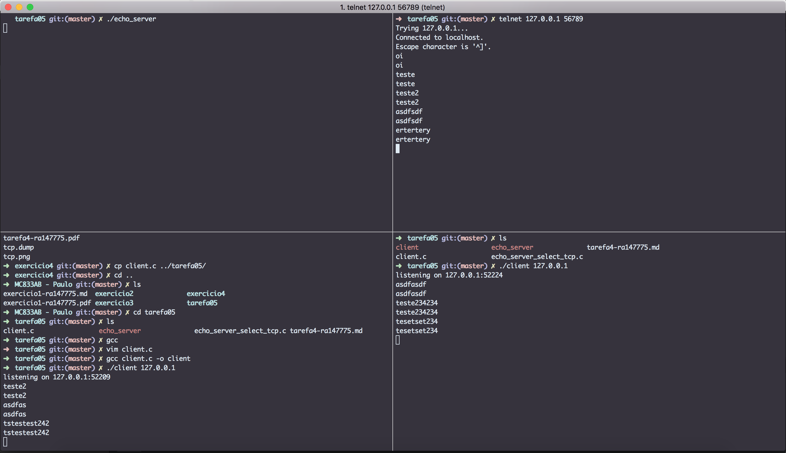

#Exercício 4
| NOME | RA |
|:-:|:------:|
| Renan Camargo de Castro | 147775 |

##Questão 1
* **select(int nfds, fd\_set *readfds, fd\_set *writefds,
                  fd\_set *exceptfds, struct timeval *timeout):** onde nfds é o maior dos números dos files descriptors + 1, readfds/writefds/exceptfds são os sets de file descriptors que vão ser monitorados pela chamada à função, e timout é um struct que define o tempo de timeout pra espera do select.

* **FD\_ZERO(fd_set \*set):** Essa macro serve para ZERAR um set de file descriptors.
* **FD\_SET/FD\_CLR(int fd, fd\_set \*set):** Adiciona e remove(respectivamente) um file descriptor à/de um set.
* **FD\_ISSET(int fd, fd_set \*set):** Testa se o fd pertence ao set.

##Questão 2

||
|:--:|
| **Screenshot comprovando a execução de vários clientes simultaneamente**|

##Questão 3
Para atender mais de um cliente "simultaneamente", foi utilizada a função select. Essa função, nada mais é, do que um "helper" para verificar o estado dos sockets.

A chamada para essa função com timeout NULL, bloqueia até que algum dos sockets incluídos nos SETS esteja disponível para leitura/escrita ou dê uma exception(de acordo com a classe de sets passados).

Nesse caso, então, o servidor bloqueia esperando que algum dos sockets de leitura esteja disponível.

Caso o socket **listenfd** esteja disponível pra leitura, então houve uma conexão nova. Nesse caso, o programa aceita a conexão, salva no vetor de clientes, e adiciona no set para o select escutar novas alterações nesses sockets.

Vemos que nessa estratégia, somente é utilizado um processo, mas o programa é acordado quando os sockets são modificados, logo, não é bloqueante e aceita mais de uma conexão "simultaneamente".

##Questão 4
Foram colocados tratamentos de erros nas funções:

* select
* accept
* read
* send

##Questão 5

No exercício passado, tínhamos um código que criava um processo filho à cada vez que recebesse uma conexão:

~~~c
	while(1) {
		if ((new_s = accept(s, (struct sockaddr *)&sin, &len)) < 0) {
			...
		}
		...
		if(fork() == 0){
			recv(new_s, buf, sizeof(buf), 0)
		}
		...
	}

~~~

Logo, temos tantos processos quanto clientes. Em um sistema operacional comum, temos um limite na quantidade de processos que podem ser executados. No mac em que foram executados os testes, é possível ver com:

~~~bash
➜  tarefa05 git:(master) ✗ sysctl -a | grep maxproc
kern.maxproc: 1064
kern.maxprocperuid: 709

~~~
Nesse caso, sabemos que só podem existir 1064 processos em execução. Em condições normais, a máquina em questão possuia 430 processos rodando, o que dá um hard limit de clientes em aproximadamente 408(supondo que 70% dos processos em execução são spawnados pelo usuário). Nesse caso, não é mais possível subir o número de processos, pois esbarrou no limite do sistema. É possível alterar esse número, mas é oneroso essa quantidade de processos no sistema.

Agora, em relação ao select, o número é limitado pela quantidade de file descriptors que o sistema deixa o processo abrir, e também o tamanho do SET que o select aceita.
Quanto ao primeiro, vemos que na minha máquina, temos o valor:

~~~bash
➜  tarefa05 git:(master) ✗ ulimit -n
2560
➜  tarefa05 git:(master) ✗ sysctl -A | grep kern.maxfiles
kern.maxfiles: 12288
kern.maxfilesperproc: 10240
~~~

E quanto ao tamanho do set, ele tem valor default 1024(de acordo com a documentação), mas é possível,facilmente alterá-lo, apenas declarando o valor FD_SETSIZE antes de importar a lib <sys/types.h>.

Com esses detalhes, vemos que a decisão com **select** escala muito mais facilmente e percebemos as diferenças entre as abordagens.