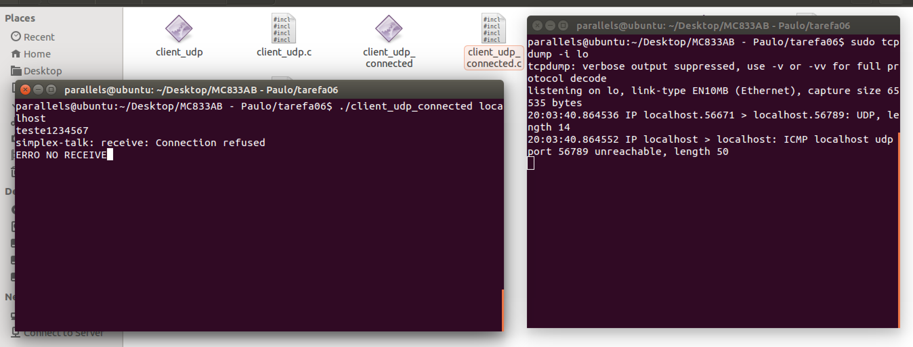
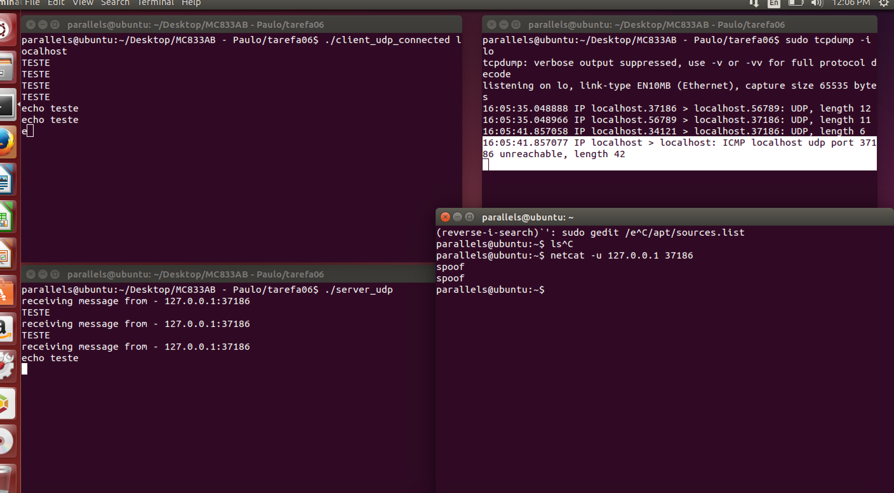

#Exercício 6
| NOME | RA |
|:-:|:------:|
| Renan Camargo de Castro | 147775 |

#Parte A
##Questão 1

* **ssize\_t recvfrom(int sockfd, void \*buf, size\_t len, int flags,
                 struct sockaddr \*src_addr, socklen\_t \*addrlen):** Essa função serve para receber mensagens de um socket, seja ele orientado à conexões(ex: tcp) ou não(ex: udp). Coloca a mensagem recebida no buffer passado, e preenche os parâmetros de quem enviou no struct src\_addr, caso ele tenha sido passado como parâmetro. Caso seja passado um src\_addr NULL, é identico à função recv() em um socket já conectado. Caso não haja mensagens na hora da chamada, a função "para" a execução esperando por uma mensagem. 
Os parâmetros são, _respectivamente_: file descriptor para um socket, um ponteiro para uma região de memória a ser usada como buffer, o tamanho do buffer, flags que definem alguns comportamentos da função(ex: MSG\_DONTWAIT, não fica esperando, caso não haja mensagem, dá erro mas continua a execução do programa sem parar), um struct do tipo sockaddr à ser preenchido pela função com os parâmetros de quem enviou a mensagem, tamanho do struct anterior. **Retorna o tamanho da mensagem lida**.

* **ssize\_t sendto(int sockfd, const void \*buf, size\_t len, int flags,
               const struct sockaddr \*dest\_addr, socklen\_t addrlen):**
Essa função serve para enviar mensagens para outro socket com o descritor de endereço informado em dest\_addr. Caso seja usado em um socket que está no modo conectado(ex: socket tcp), os parâmetros dest\_addr e addrlen são ignorados e a chamada é identica à um send() convencional. Em sockets não orientados à conexão, como o UDP, os parâmetros são obrigatórios e não podem ser nulos.
Os parâmetros são, _respectivamente_: file descriptor para um socket, um ponteiro para uma região de memória que contém a mensagem a ser enviada, o tamanho da mensagem, flags que definem alguns comportamentos da função(ex: MSG\_DONTWAIT, não fica esperando o envio da mensagem), um struct do tipo sockaddr que contém os dados do alvo, tamanho do struct anterior. **Retorna o número de caracteres enviados.**.
                 
##Questão 2

Foi feito as adaptações necessárias. O funcionamento do netcat foi testado utilizando a flag -u para indicar modo UDP.
Segue a imagem comprovando o funcionamento:

||
|-------------|
| **Screenshot comprovando a execução de vários clientes simultaneamente**|

##Questão 3
As principais diferenças entre TCP e UDP são:

* TCP é um protocolo confiável, isso é, implementa tecnologia de tratemento/recuperação de erros e garante a entrega dos pacotes, já o UDP usa a estratégia de best-effort.
* UDP não é orientado à conexão, já o TCP é.
* UDP tem menos delay com relação ao TCP.

Esses são algumas das diferenças entre eles.
Pelo fato do UDP não ser orientado à conexões, o socket do servidor recebe pacotes de qualquer cliente, logo, um socket dá conta de várias mensagens, pois cada mensagem é tratada independentemente do cliente. Por esse motivo é possível fazer um "server" para múltiplos clientes com UDP de forma "iterativa" e não é possível fazer o mesmo com TCP(que fica "preso" à um cliente). 

##Questão 4

Para comprovar esse problema, foi executado o cliente e o servidor enquando o netcat enviava um pacote UDP para o cliente na porta em que ele espera mensagens do servidor.
É fácil de observar que o cliente deveria ter recebido um echo da mensagem enviada, mas recebeu a mensagem enviada pelo netcat pensando que era do servidor.

||
|-------------|
| **Screenshot comprovando o problema de segurança com sockets UDP**|

##Questão 5
Utilizei o TCPDUMP para verificar os pacotes:

||
|-------------|
| **Screenshot verificando pacotes enviados/recebidos**|

Com isso, vemos que o pacote enviado pelo netcat não foi aceito e foi ignorado pelo cliente.
Segue o detalhamento do output do tcpdump:

~~~sh
parallels@ubuntu:~/Desktop/MC833AB - Paulo/tarefa06$ sudo tcpdump -i lo
tcpdump: verbose output suppressed, use -v or -vv for full protocol decode
listening on lo, link-type EN10MB (Ethernet), capture size 65535 bytes
14:19:05.744071 IP localhost.42082 > localhost.56789: UDP, length 15
14:19:05.744205 IP localhost.56789 > localhost.42082: UDP, length 14
 /**------ 14:19:52.210907 IP localhost.44931 > localhost.42082: UDP, length 9 -----**\
14:19:56.864339 IP localhost.42082 > localhost.56789: UDP, length 14
14:19:56.864407 IP localhost.56789 > localhost.42082: UDP, length 13
~~~

O destaque foi dado ao pacote que foi IGNORADO pelo cliente, por se tratar de outro ip/porta que não o servidor inicialmente passado.
Pode-ser verificar o tamanho: 9, isso é: "DEU ERRO\n"

#Parte B

Rodando o cliente com o servidor offline, enviei uma mensagem do cliente. Monitorei os pacotes com TCPDUMP, a saída foi a seguinte:

||
|-------------|
| **Screenshot não conectado**|

~~~sh
parallels@ubuntu:~/Desktop/MC833AB - Paulo/tarefa06$ sudo tcpdump -i lo
tcpdump: verbose output suppressed, use -v or -vv for full protocol decode
listening on lo, link-type EN10MB (Ethernet), capture size 65535 bytes
14:42:33.640377 IP localhost.44764 > localhost.56789: UDP, length 25
14:42:33.640392 IP localhost > localhost: ICMP localhost udp port 56789 unreachable, length 61
~~~

É obtido um erro ICMP, mas o retorno da função **sendto** não retorna erro, isso é, é bem sucedida e != -1.

##Questão 7
###Questão 7.1
Já com o **socket UDP conectado**, temos o mesmo erro ICMP no tcpdump, mas a função **recv** retorna um erro, isso é, seu retorno é -1 e seta o ERRNO:

||
|-------------|
| **Screenshot conectado**|

~~~sh
parallels@ubuntu:~/Desktop/MC833AB - Paulo/tarefa06$ sudo tcpdump -i lo
tcpdump: verbose output suppressed, use -v or -vv for full protocol decode
listening on lo, link-type EN10MB (Ethernet), capture size 65535 bytes
20:03:40.864536 IP localhost.56671 > localhost.56789: UDP, length 14
20:03:40.864552 IP localhost > localhost: ICMP localhost udp port 56789 unreachable, length 50
~~~

O erro retornado é ECONNREFUSED. Isso de deve ao comportamento assíncrono do erro ICMP, que é retornado na chamada ao recv. Como não foi especificado o endereço alvo(só é especificado no socket, pois ele seria conectado), e o socket não está efetivamente conectado, esse erro é spawnado mesmo sendo UDP.

Como o sendto é diferente e não existe continuidade nas chamadas, isso é, não dá pra saber que se trata do mesmo endereço, não é possível retornar o erro na próxima chamada.
Como nesse caso o socket é conectado, é possível retornar à chamada de recv com um erro que chegou depois da chamada.

###Questão 7.2

A modificação da conexão resolveu o problema de receber mensagens de outra fonte que não o servidor.

Capturando os pacotes, é possível observar que houve um erro de ICMP unreachable.
Segue os logs:

~~~sh
parallels@ubuntu:~/Desktop/MC833AB - Paulo/tarefa06$ sudo tcpdump -i lo
tcpdump: verbose output suppressed, use -v or -vv for full protocol decode
listening on lo, link-type EN10MB (Ethernet), capture size 65535 bytes
16:05:35.048888 IP localhost.37186 > localhost.56789: UDP, length 12
16:05:35.048966 IP localhost.56789 > localhost.37186: UDP, length 11
16:05:41.857058 IP localhost.34121 > localhost.37186: UDP, length 6
---- 16:05:41.857077 IP localhost > localhost: ICMP localhost udp port 37186 unreachable, length 42 -----
~~~

||
|-------------|
| **Screenshot resolvendo problema de falso server**|

##Questão 8

Fiz o teste com a mesma mensagem: "connected", e com isso pude testar o overhead de ser não conectado:

~~~sh
➜  tarefa06 git:(master) ✗ time ./not_connected_test localhost
./not_connected_test localhost  0.06s user 1.94s system 91% cpu 2.189 total
➜  tarefa06 git:(master) ✗ time ./connected_test localhost
./connected_test localhost  0.06s user 1.48s system 92% cpu 1.664 total
~~~
 
É possível observar que o conectado tem um desempenho superior, pois não precisa ficar copiando o destinatário para o Kernel. Quando se trata de um socket conectado, ele mantém no kernel o ip e a porta destino, por isso é mais rápido.

