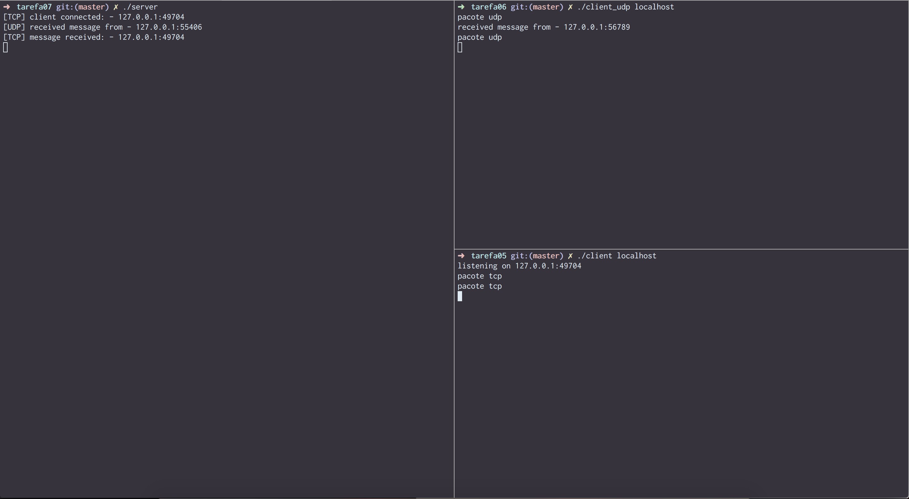
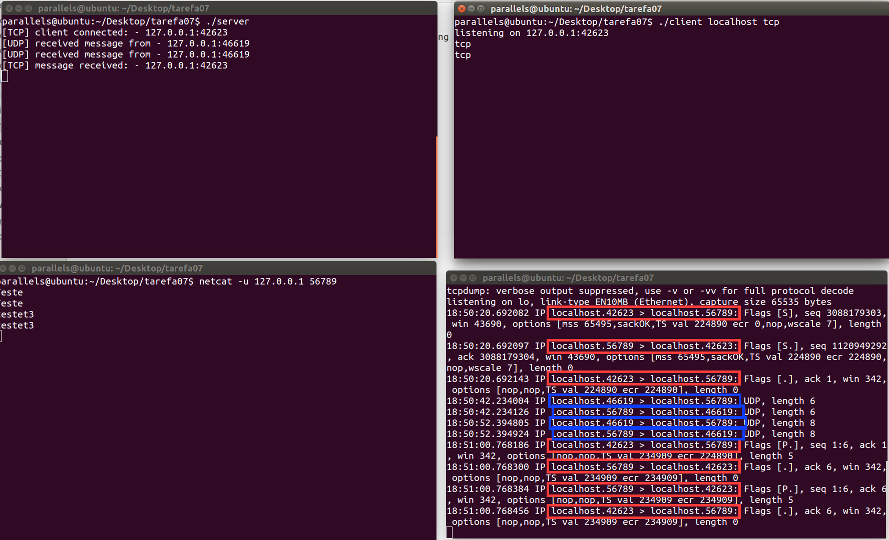

#Exercício 6
| NOME | RA |
|:-:|:------:|
| Renan Camargo de Castro | 147775 |

#Q1
* **int setsockopt(int socket, int level, int option\_name,
       const void \*option\_value, socklen\_t option\_len):** Essa função seta a opção especificada por **option_name** para o valor especificado em **value** no socket especificado pelo fd **socket** e no nível de protoloco especificado por **level**. **Retorna 0, caso sucesso e -1 caso erro**.

#Q2
Foi implementado o servidor, multiplexando os sockets de entrada com Select. Comprova-se o funcionamento com mensagens de log:

||
|-------------|
| **Screenshot verificando funcionamento de server TCP/UDP com cliente anterior**|

#Q3
Também é possível verificar utilizando TCPDUMP e netcat como cliente para comprovar os pacotes recebidos/enviados. Na screenshot a seguir foi utilizado ambos e fica claro os pacotes TCP e UDP. Em vermelho, temos os pacotes TCP e em azul, pacotes UDP.

||
|-------------|
| **Screenshot verificando funcionamento de server TCP/UDP com netcat udp e tcpdump**|
